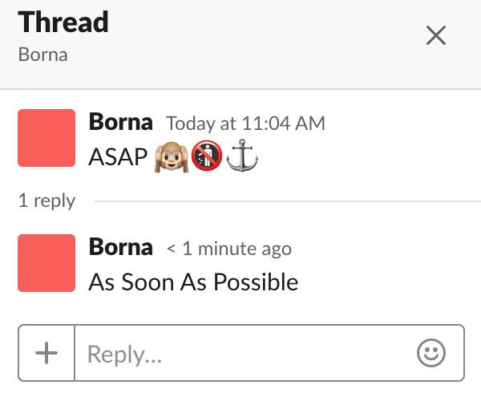

# Let's Turn Slack Into A Database (working title)

Everyone in your (my) company uses Slack. On the internal tools team at Loblaw Digital, we use Slack as a direct portal to our clients, who just so happen to be our colleagues. Why wouldn't we take advantage of this platform with great developer tools to reduce toil, increase hapiness, and get shit done quicker and easier for our friends. We call it ChatOps and our team's main product is Jeanie, a Slack app who hosts a bevy of tools that our coworkers use on a daily basis. 

Something you probably don't know about Loblaw Digital is that we have a company wide house cup tournament (kinda like Hogwarts) going on all year-round. Points are awarded for participating in activies and contests but we never really had an easy way to look up the current scores. So when we were given a day to participate in a company hackathon, we jumped at the chance to add this feature to Jeanie. We wanted the Tournament Master to be able to update points through Slack and for everyone else to be able to look up the scores. The implementation wasn't too difficult until we ran into the issue of persistent storage. Why on Earth would you spin up a database on your cluster just to store 4 numbers? We couldn't justify it. That's when we had the idea to use Slack as our database. 

The first incarnation of SlackDB was simply a private channel to which Jeanie would post a json containing the current state of Tournament points. Whenever called upon, she could just read from the most recent post in the channel's history. That was it. We didn't have to spin any pods up. We didn't need a local dev server. Slack had us covered. In this endeavour, we also noticed that our 'database' had built-in version control and rollbacks. The entire history of point allocations was up for display and we could revert to a previous state by deleting posts. Then we got thinking: what if we could turn Slack into an actual database? The idea got put on hold.

A few weeks later, one of our coworkers suggested an acronym bot for our Slack workspace. There were so many acronyms flying around that it was hard to keep up. 

> GCP is having trouble. The GCLB fronting GKE is not communicating with the PAN which is causing the ILB to fail its health check. We should check the WAF to see if packets are being dropped.

What the fuck??
  
The goal was to allow users to select a message and get Jeanie to give them a run down of whatever acronyms were used. We also wanted a way to croudsource the acronyms and use a voting system to settle disputes. Honestly, we could have done it with any regular database and a web front-end (and the UX would have suffered for it) but we used this as an excuse to build SlackDB.

## So how do you go about using Slack as a database?

We started by taking advantage of Slack's reply thread structure to build a key/value system. A message is a key and replies to that message are values. Simple enough; but how do we pick one value if there's an entire thread of posts? If we put on our thinking caps, we can identify 4 basic types of keys that Slack could support:
* 👍 votable -- we could treat the replies to a key as a ballot where reactions represent support for that particular value. winner takes all.
* 👪 multiple -- we could treat the entire reply thread as an array
* 🙉 single value push front -- we could treat only the very first reply in the thread as the value
* 🐒 single value push back -- we could treat only the most recent reply in the thread as the value

Those emojis aren't just for fun. We'll also need a way to store metadata with the keys to identify how to grab the coresponding values. For that, let's simply place the emojis after the key. And why limit ourselves to just one emoji, we can have as much metadata as we want. SlackDB v0.1.0 supports constant, 🚯, and undeletable, ⚓, keys.

Looks good so far but if you're familiar with Slack's Web API, you may have already identified a potential annoyance with programatically posting messages to channels: you need the channel ID. It's not difficult to get a channel's ID but if you have to look up an ID every time you need to interact with the SlackDB library, that's gonna suck. SlackDB should obscure that from the user which is why it needs to maintain a map of channel names 'registered' with SlackDB and their coresponding IDs. This isn't difficult to implement with an OTP GenServer but what happens when my server goes down? I don't want to lose that map. Herein lies a chicken and egg problem. 

I need persistence to use SlackDB, a library that I made to solve for persistence. Luckily, I have SlackDB, a library that I made to solve for persistence. 

Let's store the state of that map in a supervisor channel, using SlackDB. On server startup, we'll look inside that channel and pull the state. I'll still keep a copy in memory for quick access, but whenever the state is altered, I'll update the local copy as well as the supervisor channel. Now, the only channel ID I need is that of the supervisor channel. Set it and forget it. 

And that's it. All that's left now is to write the library. Luckily, I already did that for you and you can find it [here](https://github.com/azohra/SlackDB).

